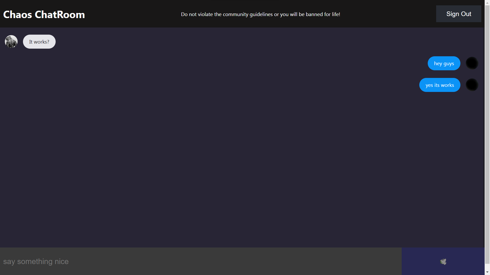

# Chaos ChatRoom App

Chaos ChatRoom is a real-time chat application built using React and Firebase. It allows users to join chat rooms, send messages, and interact with others in real-time.

## ScreenShot



## Features

- User authentication with Firebase Authentication.
- Create and join chat rooms.
- Real-time messaging with Firebase Realtime Database.
- User avatars and display names.
- Responsive design for various devices.

## Getting Started

### Prerequisites

- [Node.js](https://nodejs.org/) installed on your machine.
- A Firebase project set up. You can create one [here](https://console.firebase.google.com/).

## Installation

1. ###  Clone the repository:

   ```bash
   git clone https://github.com/yourusername/chaos-chatroom.git
    ```

2.  ### Change to the project directory:

    ```bash
    cd chaos
    ```
3.  ### Install Dependencies:
   
    <br> Using npm:
     ```bash
     npm install firebase

     npm install firebase react-firebase-hooks
     ```

4. ###  Configure Firebase:

    Create a Firebase project on the Firebase Console.
    Copy your Firebase project's configuration object from the Firebase Console to src/firebase/firebase.js.
    Start the Development Server:

5.  ### Start the Development Server:
  
    ```bash
    npm start
    ```
6.  ### Access the App:

    Open your web browser and visit http://localhost:3000 to access the app locally.


## Deployment

- To deploy the app to production, follow these steps:

1. ### Update package.json:

    Modify the homepage field in package.json to match your production URL:
    ```json
    // package.json

    "homepage": "https://yourusername.github.io/chaos-chatroom"
    ```
    ```json
     // package.json

    "scripts": {
    "start": "react-scripts start",
    "build": "react-scripts build",
    "test": "react-scripts test",
    "eject": "react-scripts eject",
    "predeploy": "npm run build", //Add
    "deploy": "gh-pages -d build" //Add
    }
    ```


2. ### Deploy to GitHub Pages:

    Run the following command to build and deploy the app:
    ```bash
    npm run deploy
    ```
    This will publish your app to the specified production URL.


## Contributing

 Contributions are welcome! If you'd like to contribute to this project, please follow these guidelines:

- Fork the repository.
- Create a new branch for your feature or bug fix.
- Make your changes and commit them with clear commit messages.
- Push your changes to your fork.
- Create a pull request to the original repository's `main` branch.


## License
This project is licensed under the MIT License. See the [LICENSE](LICENSE) file for details.


## Acknowledgments

Special thanks to the React and Firebase communities for their fantastic tools and documentation.
This project is inspired by the desire to learn and build real-time applications.

Happy chatting!